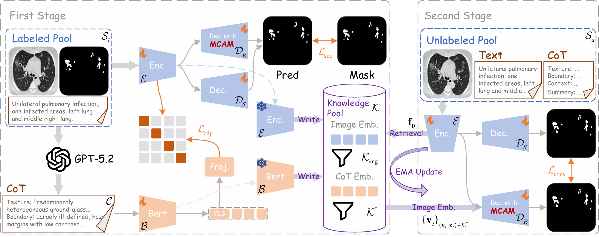

# CERS
Reposity of **"Beyond Visual Cues: CoT-Enhanced Reasoning for Semi-supervised Medical Image Segmentation"**.

## Requirements
python=3.12 and using the following command:
```
pip install -r requirements.txt
```
## Dataset Structure

This dataset is organized in a structured directory format to ensure clear separation between images, annotations, and metadata. The overall folder structure is as follows:

```
brisc2025/
├── frames/
│ ├── brisc2025_test_00001_gl_ax_t1.png
│ ├── brisc2025_test_00002_gl_ax_t1.png
│ └── ...
│
├── masks/
│ ├── brisc2025_test_00001_gl_ax_t1.png
│ ├── brisc2025_test_00002_gl_ax_t1.png
│ └── ...
│
├── reports/
│ ├── combined_messages_mask.json
│ ├── combined_messages_no_mask.json
│ ├── cot_output_gpt5_mask.csv
│ └── cot_output_gpt5_no_mask.csv
│
└── text.csv
```
